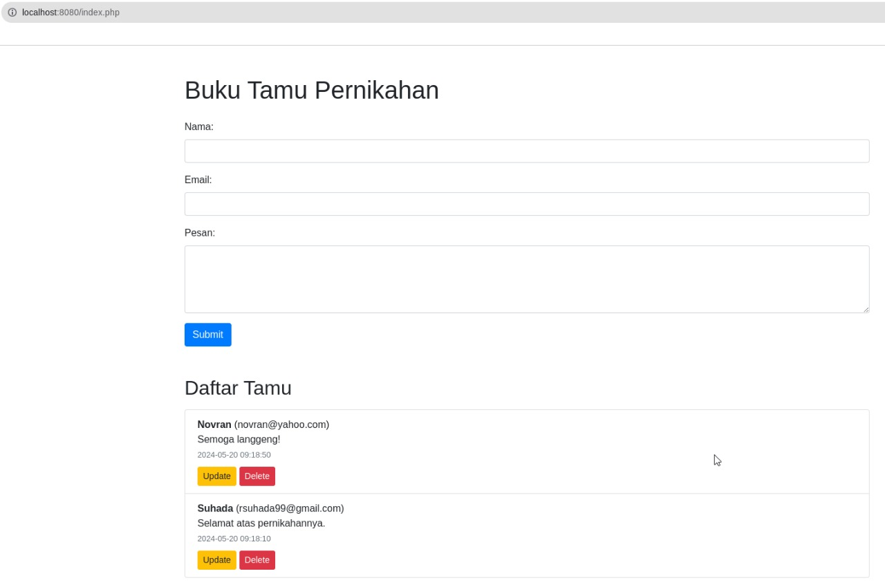

Aplikasi ini dibuat untuk memenuhi pengerjaan Ujian Tengah Semester Mata Kuliah **Pemrograman Web II**.

```
Nama  : Novran Faathir Alfathan Suposo
Kelas : IT 402
NIM   : 220401010230
```

# Buku Tamu Pernikahan

Aplikasi Buku Tamu Pernikahan adalah sebuah platform sederhana berbasis web yang memungkinkan para tamu undangan pernikahan untuk meninggalkan pesan, mengisi nama, dan email mereka. Aplikasi ini juga menyediakan fitur untuk melihat daftar tamu yang telah meninggalkan pesan, serta fitur untuk mengupdate dan menghapus entri tamu.



## Feature

**Formulir Input Tamu:**

Tamu dapat mengisi nama, email, dan pesan mereka melalui formulir yang disediakan.

**Daftar Tamu:**

Menampilkan daftar tamu yang telah mengisi buku tamu, termasuk nama, email, pesan, dan waktu pengisian.
Menggunakan Bootstrap untuk tampilan yang responsif dan rapi.

**Fitur Update Tamu:**

Tamu dapat mengupdate informasi yang sudah dikirim melalui Interface.
Formulir update dibuat untuk memudahkan proses pengeditan.

**Fitur Delete Tamu:**

Tamu dapat menghapus entri tamu yang tidak diinginkan atau salah melalui tombol delete yang tersedia.
Konfirmasi penghapusan untuk mencegah penghapusan data yang tidak disengaja.

## Technology

1. Backend: PHP dengan PDO untuk interaksi database yang aman.
2. Database: MySQL untuk penyimpanan data tamu.
3. Frontend: HTML, CSS, dan Bootstrap.
4. Docker: Docker dan Docker Compose untuk memudahkan proses pengembangan dan deployment aplikasi dalam lingkungan yang terisolasi.

## Installation

Spesifikasi
- OS: Linux (Ubuntu)
- Deployment: Docker Based

```
sudo apt install git docker.io docker-compose -y
git clone https://github.com/xchopath/bukutamu-pernikahaan
cd bukutamu-pernikahaan
sudo bash install.sh
```
